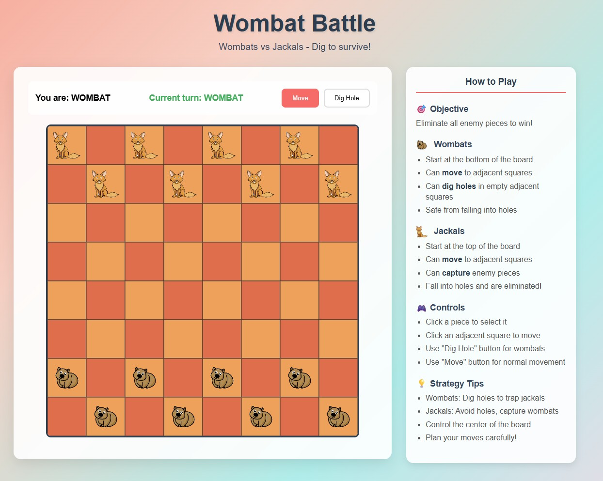

# Wombat Battle

A fun, colorful 2D board game where clever wombats battle cunning jackals! Wombats use their special digging ability to create holes and evade the stronger jackals in this strategic turn-based game.



## 🎮 Game Features

- **Strategic Gameplay**: Turn-based combat with unique mechanics for each side
- **Multiplayer Online**: Create rooms with shareable game codes to play with friends
- **AI Opponent**: Practice against an intelligent computer player
- **Custom Artwork**: Beautiful custom sprites for wombats and jackals
- **Responsive Design**: Plays great on desktop and mobile devices
- **Real-time Updates**: Instant move synchronization in multiplayer games

## 🎯 How to Play

### Objective
Eliminate all enemy pieces to win!

### Wombats
- Start at the bottom of the board
- Can **move** to adjacent squares
- Can **dig holes** in empty adjacent squares
- Safe from falling into holes

### Jackals  
- Start at the top of the board
- Can **move** to adjacent squares
- Can **capture** enemy pieces in combat
- Fall into holes and are eliminated!

### Controls
- Click a piece to select it
- Click an adjacent square to move
- Use "Dig Hole" button for wombats to create traps
- Use "Move" button for normal movement

## 🚀 Quick Start

### Prerequisites
- Node.js (v14 or higher)
- npm

### Installation & Setup
```bash
# Clone the repository
git clone https://github.com/YOUR_USERNAME/wombat-battle.git
cd wombat-battle

# Install dependencies
npm install

# Start the server
npm start
```

The game will be available at `http://localhost:3000`

### Development Mode
```bash
# Start with auto-reload for development
npm run dev
```

## 🌐 Game Modes

### Online Multiplayer
1. Click "Create Game" to generate a room code
2. Share the 6-character code with a friend
3. Friend clicks "Join Game" and enters the code
4. Both players click "Ready" to start

### AI Opponent
- Click "Play vs AI" for immediate single-player action
- The AI provides a challenging opponent with strategic thinking

## 🏗️ Technical Details

### Architecture
- **Frontend**: HTML5 Canvas for smooth 2D rendering
- **Backend**: Node.js with Express and Socket.IO
- **Real-time Communication**: WebSocket-based multiplayer
- **Game Logic**: Client-side engine with server validation

### Project Structure
```
wombat-battle/
├── server.js              # Main server and game logic
├── public/
│   ├── index.html         # Game interface
│   ├── css/style.css      # Responsive styling
│   ├── js/
│   │   ├── game.js        # Core game engine
│   │   ├── ai.js          # AI opponent logic
│   │   └── main.js        # UI and networking
│   └── images/
│       ├── wombat.png     # Custom wombat sprite
│       └── jackal.png     # Custom jackal sprite
└── package.json
```

## 🎨 Game Design

The game features a vibrant, cartoon-like aesthetic with:
- Colorful gradient backgrounds
- Custom character sprites
- Smooth animations and transitions
- Intuitive user interface
- Mobile-friendly responsive design

## 🔧 Deployment

### Local Development
The game runs on port 3000 by default. Perfect for local testing and development.

### Production Deployment
1. Set the `PORT` environment variable for your hosting platform
2. Ensure WebSocket connections are supported
3. Game sessions are stored in memory (no database required)
4. Sessions don't persist beyond server restarts

### Deployment Platforms
Works great on:
- Heroku
- Vercel
- DigitalOcean
- AWS EC2
- Any Node.js hosting platform

## 🎲 Strategy Tips

### For Wombat Players
- Use holes strategically to control board areas
- Dig holes near jackal positions to limit their movement
- Protect your pieces by creating hole barriers
- Control the center of the board

### For Jackal Players
- Avoid holes at all costs!
- Use superior numbers to corner wombats
- Attack quickly before too many holes are created
- Focus on capturing rather than positioning

## 🤝 Contributing

Feel free to contribute to Wombat Battle! Some ideas:
- Additional game modes
- Sound effects and music
- Enhanced AI difficulty levels
- Tournament brackets for multiplayer
- Spectator mode

## 📝 License

MIT License - feel free to use this code for your own projects!

## 🎉 Credits

Created with love using Claude Code. Special thanks to the strategic depth that emerges from the simple wombat digging mechanic!

---

**Ready to dig in?** Start playing Wombat Battle today! 🕳️
